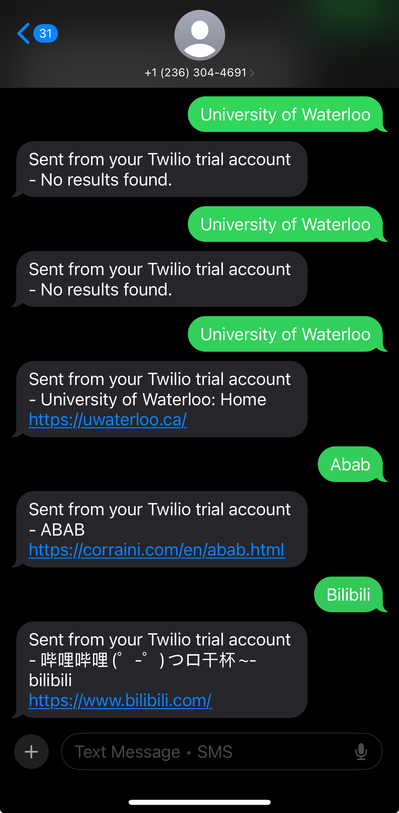

Twillio search assistant !!

> A Python-based SMS bot that allows users to perform Google searches via text message using Twilio and the Google Custom Search JSON API.

## Tech Stack
* **Language:** Python 3.10+
* **Framework:** Flask (Webhooks)
* **APIs:** Twilio (SMS), Google Custom Search JSON API
* **Tools:** ngrok (Tunneling), Dotenv (Security)

## Features
* **Real-time Querying:** Accepts incoming SMS webhooks, parses the query, and fetches live results from Google.
* **Secure Architecture:** Uses environment variables (`.env`) to protect sensitive API keys (Google & Twilio) from version control.
* **Error Handling:** Manages API failures and empty search results with user-friendly fallback messages.
* **JSON Parsing:** Extracts relevant metadata (Title, Link) from complex API response payloads.

## How It Works
1.  **User sends SMS:** "University of Waterloo" -> Twilio Number.
2.  **Twilio Webhook:** Twilio sends a POST request to the Python/Flask server.
3.  **Google Lookup:** Server authenticates with Google API and fetches the top result.
4.  **Response:** Server parses JSON and sends an SMS reply back to the user.

## Local Setup
To run this project locally:

1.  **Clone the repo**
    ```bash
    git clone [https://github.com/jsungeorge/twilio-search-assistant.git](https://github.com/jsungeorge/twilio-search-assistant.git)
    cd twilio-search-assistant
    ```

2.  **Install Dependencies**
    ```bash
    pip install flask twilio requests python-dotenv
    ```

3.  **Configure Environment**
    Create a `.env` file and add your keys:
    ```text
    GOOGLE_API_KEY=your_key
    SEARCH_ENGINE_ID=your_id
    TWILIO_ACCOUNT_SID=your_sid
    TWILIO_AUTH_TOKEN=your_token
    ```

4.  **Run the Server**
    ```bash
    python app.py
    ```

## Demo


